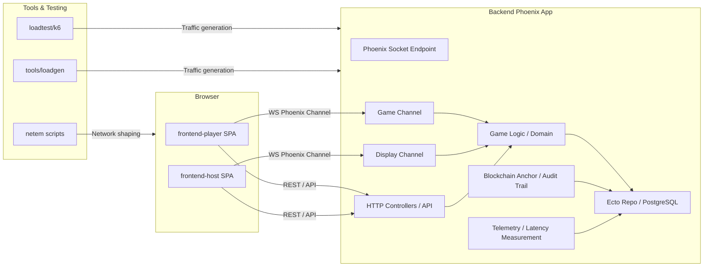

# VN Party Thesis - High Level Architecture

## Description

- `frontend-player` is the player-facing SPA that connects to the Phoenix backend via WebSocket channels and HTTP API calls.
- `frontend-host` is the host/display SPA for lobby and game display, also using WebSocket channels and API access.
- The Phoenix backend runs the game domain, channels, API controllers, persistence, blockchain anchoring, and telemetry.
- `Ecto Repo / PostgreSQL` stores rooms, players, game events, answer commits, snapshots, latency measurements, and blockchain anchors.
- `loadtest/k6`, `tools/loadgen`, and `scripts/netem` provide performance testing and network condition simulation.
